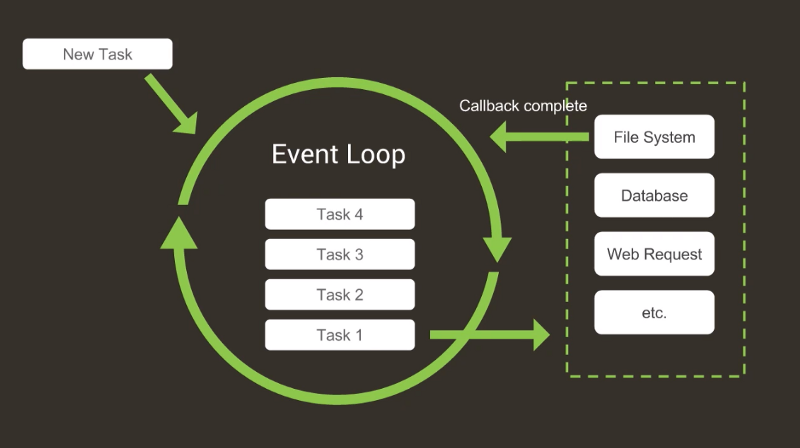

# Done ✅

## Javascript runtimes and engines

A Javascript runtime is a engine that reads, eval and execute Javascript code. We can take as example chrome's v8, Firefox SpiderMonkey and so on.

NodeJS and other popular runtimes like bun and deno in most parts acts like real runtimes, but in fact are proxies to browser runtimes. For example, NodeJS acts like a proxy to chrome's v8, reading JS code, sending it to v8 and performing OS tasks, among other things.

## NodeJS

NodeJS is a runtime build on top of three main components:

  - v8 engine for Javascript execution.
  - libuv for asynchronous tasks handling.
  - Core C++ layer for data flow.

In the main NodeJS event-loop, everytime it encounters an async operation, it will be delegated to libuv, who will execute the operation a call a provided callback. The event-loop is single threaded, while the async tasks can have multiple threads.



The C++ layer is responsible for reading the JS sources, and sending this string to a JS engine, and there, the JS code will be transformed in C++ Objects. This layer is responsible for executing the event-loop.

## Project

So said that, `done` is a toy NodeJS clone made for understanting those core NodeJS concepts.

## Running

This project uses [xmake](https://xmake.io/#/) as the main tool.

### Hot-reload

You can use the `./scripts/hot-reload` script to hot-reload the project using *nodemon*.

### Main target

For running `done` just use the command:

```bash
xmake run -w . -- done index.js
```

### Separate Examples

Also, for runnign the standalone examples, just use the command:

```bash
xmake run <EXAMPLE>
```

Where <EXAMPLE> is a file name inside the `standalone` dir without the extention.

## Acknowledgements

Many thanks to @ErickWendel for showing me those concepts and for being a wonderful teacher.
